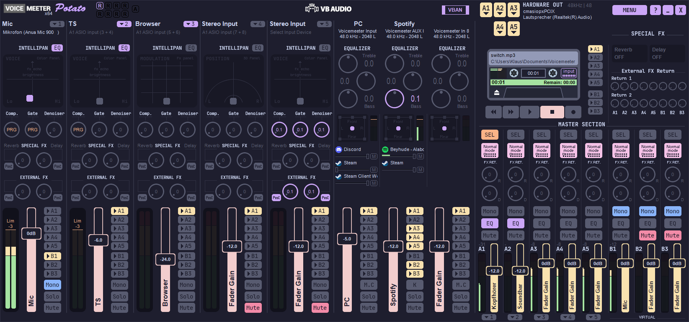
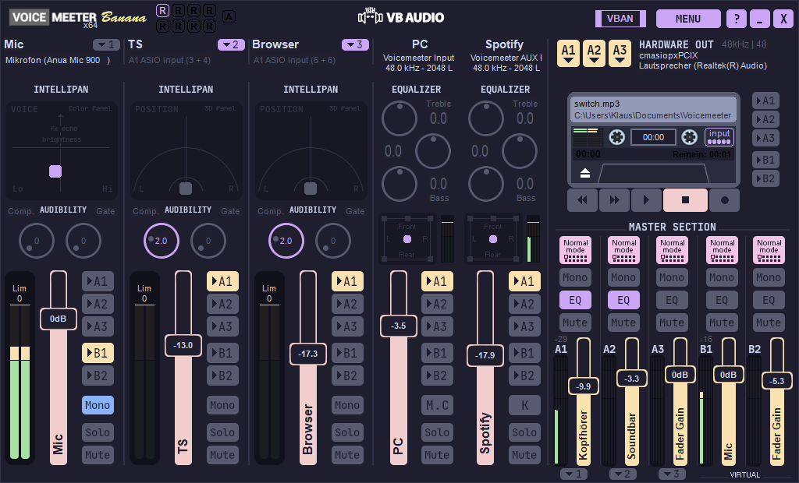

# Catppuccin Mocha for Voicemeeter
### (for Banana & Potato)






Voicemeeter theme that uses the [Catppuccin Mocha](https://github.com/catppuccin/catppuccin) color palette.

## Usage

This theme is meant to be used with [voicemeeter-themes-mod](https://github.com/emkaix/voicemeeter-themes-mod).

1. [Download the repository as ZIP file.](https://github.com/emkaix/voicemeeter-theme-catppuccin-mocha/archive/refs/heads/main.zip)
2. Extract `theme.json` and the `themes` folder into `C:\Users\<USER>\Documents\Voicemeeter\`
3. You should now have:

```
C:\Users\<USER>\Documents\Voicemeeter\theme.json
C:\Users\<USER>\Documents\Voicemeeter\themes\potato\catppuccin_mocha\bg.bmp
C:\Users\<USER>\Documents\Voicemeeter\themes\potato\catppuccin_mocha\bg_settings.bmp
C:\Users\<USER>\Documents\Voicemeeter\themes\potato\catppuccin_mocha\colors.json
```
4. Launch Voicemeeter with [voicemeeter-themes-mod](https://github.com/emkaix/voicemeeter-themes-mod) launcher.
